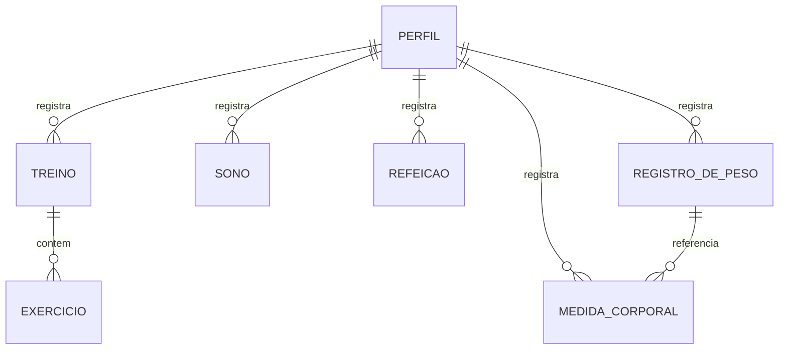

# Domain Model — Pulse

## Purpose
O Pulse é um aplicativo de acompanhamento de rotina e evolução física. Ele
centraliza dados de treinos, exercícios, alimentação, sono, peso e medidas
corporais de um usuário, permitindo acompanhar progresso ao longo do tempo.

Este documento reflete o schema do banco de dados do Pulse (ver
`create-tables.sql`), servindo de referência para os specs de capability
(ex.: `treinos/`, `refeicoes/`, `sono/`) e para o agente de IA que vai
implementar o sistema sobre esse schema.

> Nota: entidades marcadas como "planejadas" no `project-overview.md`
> (ex.: `UserGoal`/`user_goals`) NÃO devem ser tratadas como existentes até
> confirmação explícita de implementação, conforme regra do AGENTS.md.

## Core Concepts (Entities & Value Objects)

### Requirement: Perfil (Profile)
O sistema DEVE definir uma entidade `Perfil` representando o usuário e
contendo:
- id: identificador único
- nome: string (até 50 caracteres)
- data_de_nascimento: date
- sexo: enum (Feminino, Masculino)
- altura_cm: number
- tipo_fisico: decimal(5,2)
- nivel_fisico: string (até 20 caracteres)
- modalidade_fav: enum (Musculação, Corrida, Yoga)
- horario_fav_de_treino: number (opcional)
- meta_semanal: number
- objetivo: enum (Emagrecimento, Hipertrofia, Condicionamento) — opcional
- medidas: boolean (indica se o usuário possui medidas corporais registradas)
- onboarding_concluido: boolean (controla se o fluxo de onboarding já foi
  finalizado)
- data_atualizacao: datetime — opcional, atualizado automaticamente

#### Scenario: Criação de perfil
- **Given** um novo usuário se cadastra no Pulse
- **When** ele preenche nome, data de nascimento, sexo e altura
- **Then** um registro de Perfil é criado automaticamente vinculado ao usuário

---

### Requirement: Treino (Workout session)
O sistema DEVE definir uma entidade `Treino` associada a um Perfil,
representando uma sessão de treino, contendo:
- id: identificador único
- profile_id: referência ao Perfil
- categoria: enum (Superior, Inferior, Full body)
- inicio: datetime
- fim: datetime
- intensidade: enum (Leve, Moderada, Intensa) — opcional
- anotacoes: string — opcional
- calorias_estimadas: decimal(5,2) — opcional
- analise_ia: text — opcional (resultado de análise gerada por IA sobre o treino)
- data: date

> Alteração em relação à versão anterior deste documento: carga e
> repetições saem do Treino e passam a pertencer à entidade `Exercicio`
> abaixo, já que um Treino pode conter múltiplos exercícios (conforme
> `project-overview.md`). Confirmar se essa estrutura já existe assim no
> Xano ou se precisa ser criada.

#### Scenario: Registro de treino
- **Given** um usuário inicia uma sessão de treino
- **When** ele registra categoria, início, fim e (opcionalmente) intensidade
  e anotações
- **Then** o sistema salva o Treino vinculado ao seu Perfil

---

### Requirement: Exercício (Exercise)
O sistema DEVE definir uma entidade `Exercicio` associada a um Treino,
contendo:
- id: identificador único
- treino_id: referência ao Treino
- nome_exercicio: string (até 50 caracteres)
- ordem: number (posição do exercício dentro do treino)
- series: number
- repeticoes: number
- carga: decimal — opcional

#### Scenario: Registro de exercício dentro de um treino
- **Given** um usuário está registrando um Treino
- **When** ele adiciona um exercício com nome, ordem, séries, repetições e
  (opcionalmente) carga
- **Then** o sistema salva o Exercicio vinculado ao Treino correspondente

---

### Requirement: Sono (Sleep)
O sistema DEVE definir uma entidade `Sono` associada a um Perfil, contendo:
- id: identificador único
- profile_id: referência ao Perfil
- tipo_sono: enum (Principal, Soneca) — opcional, permite múltiplos
  períodos de sono no mesmo dia
- inicio_sono: datetime
- fim_sono: datetime
- qualidade_sono: enum (Muito ruim, Ruim, Regular, Bom, Muito bom) — opcional
- observacoes: string — opcional

#### Scenario: Registro de sono
- **Given** um usuário quer registrar sua noite de sono
- **When** ele informa horário de início e fim
- **Then** o sistema salva o registro de Sono vinculado ao seu Perfil

#### Scenario: Registro de soneca no mesmo dia
- **Given** um usuário já registrou o sono principal do dia
- **When** ele registra um novo período de sono do tipo "Soneca"
- **Then** o sistema salva um novo registro de Sono, sem sobrescrever o
  registro anterior

---

### Requirement: Refeição (Meal)
O sistema DEVE definir uma entidade `Refeição` associada a um Perfil,
contendo:
- id: identificador único
- profile_id: referência ao Perfil
- data_refeicao: datetime
- tipo: enum (Café da manhã, Almoço, Café da tarde, Jantar) — opcional
- descricao: string — opcional (descrição livre da refeição/alimentos)
- calorias: decimal(5,2)
- proteinas: string (até 25 caracteres)
- carboidratos: string (até 25 caracteres)
- gorduras: string (até 25 caracteres)
- analise_ia: text — opcional (resultado de análise gerada por IA sobre a refeição)

#### Scenario: Registro de refeição
- **Given** um usuário registra uma refeição
- **When** ele informa tipo, calorias, proteínas, carboidratos e gorduras
- **Then** o sistema salva a Refeição vinculada ao seu Perfil

---

### Requirement: Registro de Peso (Weight Log)
O sistema DEVE definir uma entidade `RegistroDePeso` associada a um
Perfil, contendo:
- id: identificador único
- profile_id: referência ao Perfil
- peso: decimal(5,2)
- data_horario: datetime
- observacoes: string — opcional

#### Scenario: Registro de peso
- **Given** um usuário se pesa
- **When** ele registra o valor e a data/hora
- **Then** o sistema salva um novo RegistroDePeso vinculado ao seu Perfil

---

### Requirement: Medida Corporal (Body Measurement)
O sistema DEVE definir uma entidade `MedidaCorporal` associada a um
Perfil, e opcionalmente a um RegistroDePeso, contendo:
- id: identificador único
- profile_id: referência ao Perfil
- peso_id: referência ao RegistroDePeso — opcional
- cintura_cm: decimal — opcional
- quadril_cm: decimal — opcional
- peito_cm: decimal — opcional
- braco_cm: decimal — opcional
- coxa_cm: decimal — opcional
- panturrilha_cm: decimal — opcional
- data: date

#### Scenario: Registro de medida corporal vinculada a uma pesagem
- **Given** um usuário acabou de registrar seu peso
- **When** ele opcionalmente informa medidas corporais no mesmo momento
- **Then** o sistema salva a MedidaCorporal referenciando o RegistroDePeso
  correspondente

#### Scenario: Registro de medida corporal isolada
- **Given** um usuário quer registrar medidas corporais sem estar
  necessariamente se pesando
- **When** ele preenche ao menos uma medida
- **Then** o sistema salva a MedidaCorporal vinculada ao Perfil, sem
  referência a um RegistroDePeso

## Relationships

- **Perfil 1:N Treino**
- **Treino 1:N Exercicio**
- **Perfil 1:N Sono**
- **Perfil 1:N Refeição**
- **Perfil 1:N RegistroDePeso**
- **Perfil 1:N MedidaCorporal**
- **RegistroDePeso 1:N MedidaCorporal** (opcional)

## Business Rules / Invariants

- Todo registro (Treino, Sono, Refeição, RegistroDePeso, MedidaCorporal)
  DEVE estar vinculado a um Perfil existente (`profile_id`)
- Todo `Exercicio` DEVE estar vinculado a um `Treino` existente (`treino_id`)
- `fim` DEVE ser posterior a `inicio` (Treino) e `fim_sono` DEVE ser
  posterior a `inicio_sono` (Sono)
- `peso`, `calorias`, `carga`, `repeticoes`, `series` DEVEM ser valores não negativos
- Cada usuário só pode visualizar e editar seus próprios registros (RLS —
  ver `project-overview.md`, seção "Segurança e regras do banco")

## Glossary

- **Perfil**: representação do usuário dentro do domínio do Pulse
- **Treino**: sessão de treino, que agrupa um ou mais exercícios
- **Exercício**: um exercício individual dentro de um Treino, com suas
  próprias séries, repetições e carga
- **MedidaCorporal**: conjunto de medidas corporais, podendo ou não estar
  vinculado a uma pesagem específica